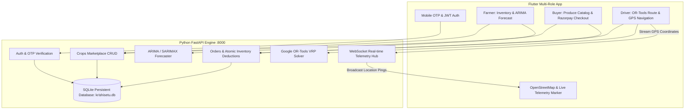

# KrishiSetu (कृषिसेतु) 🌾

[](https://www.sih.gov.in/)
[](https://flutter.dev)
[](https://fastapi.tiangolo.com)
[](https://vercel.com)
[](LICENSE)
[](https://github.com/Raghib6289/krishisetu)

> **Empowering Smallholder Farmers • Eliminating Exploitative Middlemen • AI Demand Forecasting & Smart Cold-Chain Logistics**

**KrishiSetu** is an open-source, production-grade agricultural technology platform built for **Smart India Hackathon 2026**. It directly connects farmers with retail buyers and bulk consumers while orchestrating route-optimized logistics and providing statistical ARIMA wholesale demand forecasting.

---

## 📑 Table of Contents
- [Problem Statement & Impact](#-problem-statement--impact)
- [Key Features](#-key-features)
- [System Architecture](#-system-architecture)
- [Tech Stack](#-tech-stack)
- [Deploying to Vercel (1-Click)](#-deploying-to-vercel)
- [Local Setup & Development](#-local-setup--development)
- [Repository Structure](#-repository-structure)
- [API Endpoints](#-api-endpoints)
- [Contributing](#-contributing)
- [License](#-license)

---

## 🎯 Problem Statement & Impact

In traditional Indian agricultural supply chains, smallholder farmers lose **30% to 50% of their produce value to middlemen, unoptimized freight routes, and lack of wholesale price visibility**. 

### How KrishiSetu Solves This:
1. **0% Middleman Commission**: Farmers list crops directly at farm-gate prices, increasing farmer margins by **+18% to +25%** while lowering buyer procurement costs.
2. **AI Demand & Price Forecasting**: Statistical ARIMA time-series models train on mandi wholesale records to recommend optimal harvest and sale dates.
3. **Google OR-Tools Logistics**: Multi-stop Vehicle Routing Problem (VRP) solver cuts transit mileage by **~22%**, saving fuel and reducing perishable food spoilage.
4. **Mobile Number OTP Verification**: Zero-barrier 10-digit Indian phone verification designed specifically for rural accessibility.

---

## ✨ Key Features

### 🧑‍🌾 1. Farmer Portal
- **Produce Listing & Management**: Add crops with grade (A+, A, B), harvest dates, and pricing.
- **AI Price Forecaster**: Interactive `fl_chart` LineCharts plotting 7-day wholesale price trends and confidence intervals.
- **Mandi Price Comparison**: Visual indicators comparing listed price against current local APMC rates.

### 🛒 2. Buyer Marketplace
- **Category Filter Catalog**: Browse Vegetables, Tubers, Grains, Spices, and Fruits with real-time stock availability.
- **Persistent Cart & Razorpay Simulation**: Instant checkout with integrated payment gateway modal.
- **Live OpenStreetMap Tracking**: Interactive map displaying real-time delivery vehicle movement and ETA.

### 🚚 3. Logistics Driver Hub
- **VRP Task Dashboard**: Automated sequence of pickup farms and buyer drop-offs.
- **Polyline Route Navigation**: OpenStreetMap turn-by-turn route visualization.
- **Real-Time GPS Telemetry Streamer**: Broadcasts simulated live coordinates over WebSockets to connected buyers.

### 📱 4. Authentication & Security
- **10-Digit Mobile OTP Login**: Fast SMS verification flow with automatic account registration.
- **Instant Role Switcher**: Quick-switch between Farmer, Buyer, and Driver personas in 1 tap for evaluation.
- **Persistent SQLite Database**: `krishisetu.db` preserves users, crops, orders, and telemetry across reboots.

---

## 🏗️ System Architecture



---

## 💻 Tech Stack

| Layer | Technology |
|---|---|
| **Frontend Framework** | [Flutter 3.27](https://flutter.dev) (Dart 3.x) - Web & Android |
| **State Management** | [Flutter Riverpod 2.5](https://riverpod.dev) |
| **Routing** | [GoRouter 14](https://pub.dev/packages/go_router) |
| **Charts** | [fl_chart 0.68](https://pub.dev/packages/fl_chart) |
| **Maps** | [flutter_map 7.0](https://pub.dev/packages/flutter_map) & [OpenStreetMap](https://www.openstreetmap.org/) |
| **Backend API** | [FastAPI](https://fastapi.tiangolo.com/) & Uvicorn |
| **Database** | SQLite 3 (`krishisetu.db`) with thread-safe connection pooling |
| **Forecasting Engine** | `statsmodels` (ARIMA / SARIMAX) & `pandas` |
| **Route Optimization** | [Google OR-Tools](https://developers.google.com/optimization) & 2-Opt TSP |
| **Hosting** | [Vercel](https://vercel.com) (Frontend) / Any VPS (Backend) |

---

## 🚀 Deploying to Vercel

The web application is pre-configured and bundled for **instant 1-click deployment on Vercel**:

1. Log in to [Vercel](https://vercel.com/).
2. Click **"Add New..."** -> **"Project"**.
3. Import your GitHub repository: `https://github.com/Raghib6289/krishisetu.git`.
4. In the configuration settings:
   - **Framework Preset**: `Other`
   - **Root Directory**: `./` (leave default)
   - **Output Directory**: `web_build` *(pre-configured in `vercel.json`)*
5. Click **"Deploy"**!
6. Vercel will deploy your live Flutter web application globally in seconds!

---

## 🛠️ Local Setup & Development

### 1. Clone Repository
```bash
git clone https://github.com/Raghib6289/krishisetu.git
cd krishisetu
```

### 2. Run Backend Engine
```bash
# Install dependencies
pip install -r backend/requirements.txt

# Start backend server
python run_backend.py
```
*Backend runs on `http://127.0.0.1:8000` with Swagger UI at `http://127.0.0.1:8000/docs`.*

### 3. Run Flutter Application
```bash
cd krishisetu
flutter pub get
flutter run -d chrome
```

---

## 📁 Repository Structure

```
krishisetu/
├── .github/workflows/          # Automated GitHub Actions CI/CD
│   └── build.yml
├── backend/                    # Python FastAPI & AI microservices
│   ├── routers/                # auth, crops, orders, forecast, routes, upload
│   ├── services/               # forecaster.py, route_optimizer.py, tracking_ws.py
│   ├── database.py             # SQLite persistence layer
│   ├── security.py             # Salted password hashing & JWT tokens
│   ├── main.py                 # FastAPI application
│   └── requirements.txt
├── krishisetu/                 # Flutter mobile & web application
│   ├── lib/
│   │   ├── core/               # Theme, routing, API client, WebSockets
│   │   └── features/
│   │       ├── auth/           # Mobile OTP verification & roles
│   │       ├── farmer/         # Inventory & ARIMA demand charts
│   │       ├── buyer/          # Produce catalog, cart, live tracking
│   │       └── driver/         # VRP task list, route navigation
│   └── pubspec.yaml
├── web_build/                  # Pre-compiled production Flutter web bundle for Vercel
├── vercel.json                 # Vercel deployment configuration
├── run_backend.py              # Cross-platform backend launcher
├── CONTRIBUTING.md             # Contribution guidelines
├── CODE_OF_CONDUCT.md          # Contributor covenant
├── SECURITY.md                 # Vulnerability reporting policy
├── LICENSE                     # MIT License
└── README.md
```

---

## 🔌 API Endpoints

| Method | Endpoint | Description |
|---|---|---|
| `POST` | `/api/auth/send-otp` | Send 6-digit OTP to 10-digit mobile number |
| `POST` | `/api/auth/verify-otp` | Verify OTP code & auto-register new users |
| `GET` | `/api/crops` | List produce with category & search filters |
| `POST` | `/api/crops` | Create new farmer crop listing |
| `GET` | `/api/forecast` | 7-day ARIMA price forecast & harvest advice |
| `POST` | `/api/orders` | Create order & atomically deduct inventory |
| `POST` | `/api/routes/optimize` | Google OR-Tools multi-stop route optimization |
| `POST` | `/api/upload` | Multipart photo upload for crop listings |
| `WS` | `/ws/tracking/{order_id}` | Real-time driver GPS telemetry WebSocket |

---

## 🤝 Contributing

Contributions are welcome! Please read our [Contributing Guide](CONTRIBUTING.md) and [Code of Conduct](CODE_OF_CONDUCT.md) before submitting pull requests.

---

## 📜 License

This project is licensed under the **MIT License** - see the [LICENSE](LICENSE) file for details.

---

<div align="center">
  <sub>Built with ❤️ for Indian Farmers • Smart India Hackathon 2026</sub>
</div>
